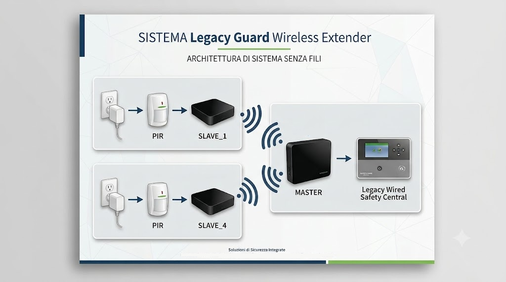

# Specifiche Generali di Sistema — LegacyGuard Wireless Extender 

Questo documento descrive nel dettaglio l'architettura, le componenti, i protocolli di comunicazione e le modalità operative del sistema di allarme/ripetitore PIR Master-Slave.

---
 
---

## 1. Architettura di Rete e Comunicazione

* **Tipologia Rete**: Wi-Fi Standard 802.11b (configurato per massimizzare la portata e la stabilità del segnale senza sleep radio).
* **Topologia**: Stella (Master al centro, Slave periferici).
* **Indirizzamento IP**:
  * **Master**: `192.168.4.1`
  * **Slave ID 2**: `192.168.4.2`
  * **Slave ID 3**: `192.168.4.3`
  * **Slave ID 4**: `192.168.4.4`
  * **Slave ID 5**: `192.168.4.5`
* **Porta del Server TCP Slave**: `80` (utilizzata dal Master per interrogare lo stato degli slave).
* **Potenza di Trasmissione TX (Slave)**: 20.5 dBm.

---

## 2. Modulo Master (`4MASTER32_displ_pir_wdog_100`)

Il nodo Master (basato su ESP32) coordina la rete, interroga periodicamente gli slave e gestisce la logica degli allarmi.

### 2.1 Logica di Allarme e Relè
* **Stati rilevati dallo Slave**:
  * `STA100`: Slave presente, nessun allarme.
  * `STA113`: Slave presente, allarme rilevato (sensore PIR attivato).
* **Comportamento Relè**: Se almeno uno slave risponde con `STA113`, l'uscita a relè viene attivata. Il relè resta eccitato per un tempo minimo di **2 secondi**, anche se la condizione di allarme rientra prima.
* **Mappatura Conservativa**: Un nodo visto anche solo una volta viene memorizzato come "Presente". Per essere dichiarato "Assente", deve fallire multiple risposte consecutive al polling.

### 2.2 Display OLED Master
La matrice del display mostra lo stato dei 4 nodi in forma sintetica:
* `A2`: Slave 2 in Allarme.
* `N3`: Slave 3 Normale / Senza allarme.
* `..`: Slave Non rilevato / Assente.

### 2.3 Indicatori LED Master
* **LED di Bordo**: Alterna stato ad ogni ciclo completo di polling (indicatore di attività).
* **LED Ausiliario (GPIO 9)**: Si illumina durante le fasi di scan e mappatura degli slave.

### 2.4 Ingressi di Servizio (Ponticelli Master)
* **GPIO 4 ➔ GND**: Salta il ritardo di riscaldamento iniziale di 90 secondi.
* **GPIO 10 ➔ GND**: Forza la rimappatura dinamica degli slave ad ogni ciclo.

### 2.5 Console Diagnostica (Seriale & Telnet)
L'accesso alla console di amministrazione avviene tramite **Seriale USB (115200 baud)** oppure via **Telnet**:
* **Accesso Telnet**: `telnet 192.168.4.1 2323`
* **Credenziali Console**: User: `admin` | Password: `Pautax2006`
* **Menu Diagnostico (Comando `m` o `M`)**:
  * `0`: Reset hardware della scheda.
  * `1`: Stampa il nome del file sorgente firmware.
  * `2`: Stampa statistiche dettagliate (allarmi, chiamate OK, chiamate FALLITE per ogni slave).
  * `3`: Abilita/Disabilita diagnostica estesa (tracing funzioni).
  * `4`: Avvia scan continuo di presenza/assenza (uscita con `q`).
  * `5`: Attiva la modalità aggiornamento OTA via Web.
  * `6`: Stampa Indirizzo MAC.
  * `99`: Uscita dal menu.

### 2.6 Aggiornamento Firmware Web OTA
1. Aprire la sessione Telnet ed entrare nel menu diagnostico (`m`).
2. Selezionare l'opzione `5` per abilitare l'OTA (il Master entra in modalità manutenzione).
3. Aprire il browser all'indirizzo `http://192.168.4.1/update` (HTTP, non HTTPS).
4. Inserire le credenziali OTA (`admin` / `Pautax2006`).
5. Caricare il file `.bin` compilato e attendere il riavvio automatico.

---

## 3. Modulo Slave PIR (`Wemos D1 mini`)

Ogni nodo Slave acquisisce il segnale dal sensore PIR e risponde alle chiamate TCP del Master.

### 3.1 Funzionalità Principali
* **Rilevamento Allarme Memorizzato (Latch)**: Quando il PIR rileva un'intrusione, il flag di allarme viene alzato e memorizzato (latched). **Importante**: il semplice polling da parte del Master NON azzera lo stato di allarme.
* **Reset Allarme via Comando `STA155`**: Lo stato di allarme memorizzato (e il relativo LED diagnostico) si azzera **esclusivamente** quando lo Slave riceve il comando specifico con codice `155` / `STA155` (inviato via TCP o Seriale).
* **Watchdog Software**: Timer a 8 secondi con auto-reset della scheda in caso di blocco del codice.
* **Risposta TCP**: Invia lo stato (`STA100` in assenza di allarme, `STA113` in presenza di allarme latched), il numero progressivo di chiamata (`CALL`) e la potenza del segnale Wi-Fi (`RADIO` / `RSSI`).

### 3.2 Display OLED Slave
* **Riga 1**: ID Slave (`SLAVE_ID`) e stato connessione Wi-Fi (`CONN` / `NOCN`).
* **Riga 2**: Stato Allarme (`OK` / `AL`).
* *Fase di avvio*: Mostra il countdown dei secondi rimanenti al riscaldamento del sensore PIR.

### 3.3 Codici e Funzionalità LED Slave
* **LED_BUILTIN** (attivo LOW):
  * **Toggle (1 “blink” di stato)**: Inverte il proprio stato ad ogni risposta trasmessa al Master (sia via TCP sia via comando seriale `?`). Serve da indicatore di attività/polling.
  * **Doppio blink (2 blink) durante riscaldamento PIR**: Nella fase di countdown di 90 s (se non saltata tramite D6→GND) esegue una sequenza fissa di **2 lampeggi rapidi** per ogni secondo di attesa:
    * ON 120 ms → OFF 120 ms → ON 120 ms → ripristino stato precedente + pausa 640 ms.
    * La sequenza è ripetuta per ogni secondo del countdown (funzione `blinkWarmupDouble()`).
  * Non sono implementati pattern a 3 o 4 blink; il LED_BUILTIN usa esclusivamente il toggle di attività e il doppio blink di warmup.
* **LED Diagnostico Allarme (`LED_DIAG_PIN` su D7)**:
  * **Si accende (HIGH)**: Non appena il PIR rileva un allarme e alza il flag interno.
  * **Rimane ACCESO**: Anche durante i normali cicli di polling/interrogazione, finché l'allarme resta memorizzato.
  * **Si spegne (LOW)**: Soltanto dopo la ricezione esplicita del comando di reset (inviata dal MASTER) `STA155`.

### 3.4 Ingressi Hardware e Interfacce Slave
* **Pin D6 (`SkipDelayPir`)**: Pull-up interno. Se ponticellato a GND all'avvio, salta il countdown di 90s del PIR (utilizzato per debug/test).
* **Pin D5 (`InputPir`)**: Ingresso del sensore PIR con pull-up interno. Supporta la configurazione con optocoppiatore/contatto normalmente chiuso (`PirReverse = false` o `true` in base alla logica del sensore).
* **Pin D7 (`LED_DIAG_PIN`)**: Uscita attiva alta collegata all'anodo del LED diagnostico allarme (con opportuna resistenza di limitazione verso GND).
* **Interfaccia Seriale USB**:
  * Inviando `?` simula una chiamata di polling fornendo la risposta di stato.
  * Inviando `155` o `STA155` forza il reset immediato dell'allarme latched e lo spegnimento del LED diagnostico.
