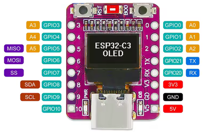

# General System Specifications — LegacyGuard Wireless Extender

This document describes in detail the architecture, components, communication protocols, and operating modes of the wireless link system for a legacy (wired) alarm control panel.

---

## 1. Network Architecture and Communication

* **Network Type**: Wi-Fi Standard 802.11b (configured to maximize range and signal stability without radio sleep).
* **Topology**: Star (Master at the center, peripheral Slaves).
* **IP Addressing**:
  * **Master**: `192.168.4.1`
  * **Slave ID 2**: `192.168.4.2`
  * **Slave ID 3**: `192.168.4.3`
  * **Slave ID 4**: `192.168.4.4`
  * **Slave ID 5**: `192.168.4.5`
* **Slave TCP Server Port**: `80` (used by the Master to query the status of the slaves).
* **TX Transmission Power (Slave)**: 20.5 dBm.

---

## 2. Master Module (`4MASTER32_displ_pir_wdog_70`)

The Master node (based on ESP32) coordinates the network, periodically queries the slaves, and manages the alarm logic.

### 2.1 Alarm Logic and Relay
* **States detected by the Slave**:
  * `STA100`: Slave present, no alarm.
  * `STA113`: Slave present, alarm detected (PIR sensor activated).
* **Relay Behavior**: If at least one slave responds with `STA113`, the relay output is activated. The relay remains energized for a minimum time of **2 seconds**, even if the alarm condition clears earlier.
* **Conservative Mapping**: A node seen even only once is memorized as "Present". To be declared "Absent", it must fail multiple consecutive responses to polling.

### 2.2 Master OLED Display
The display matrix shows the status of the 4 nodes in synthetic form:
* `A2`: Slave 2 in Alarm.
* `N3`: Slave 3 Normal / No alarm.
* `..`: Slave Not detected / Absent.

### 2.3 Master LED Indicators
* **Edge LED**: Alternates state at each complete polling cycle (activity indicator).
* **Auxiliary LED (GPIO 9)**: Lights up during slave scan and mapping phases.

### 2.4 Service Inputs (Master Jumpers)
* **GPIO 4 ➔ GND**: Skips the initial 90-second warm-up delay.
* **GPIO 10 ➔ GND**: Forces dynamic remapping of the slaves at every cycle.

### 2.5 Diagnostic Console (Serial & Telnet)
Access to the administration console is via **USB Serial (115200 baud)** or via **Telnet**:
* **Telnet Access**: `telnet 192.168.4.1 2323`
* **Console Credentials**: User: `admin` | Password: `Pautax2006`
* **Diagnostic Menu (Command `m` or `M`)**:
  * `0`: Hardware reset of the board.
  * `1`: Prints the source firmware file name.
  * `2`: Prints detailed statistics (alarms, OK calls, FAILED calls for each slave).
  * `3`: Enables/Disables extended diagnostics (function tracing).
  * `4`: Starts continuous presence/absence scan (exit with `q`).
  * `5`: Activates Web OTA update mode.
  * `6`: Prints MAC Address.
  * `99`: Exit from the menu.

### 2.6 Web OTA Firmware Update
1. Open the Telnet session and enter the diagnostic menu (`m`).
2. Select option `5` to enable OTA (the Master enters maintenance mode).
3. Open the browser at the address `http://192.168.4.1/update` (HTTP, not HTTPS).
4. Enter the OTA credentials (`admin` / `Pautax2006`).
5. Upload the compiled `.bin` file and wait for the automatic reboot.
p.s. more details on programming and OTA are available in paragraph 8. (Reproducing the project: what is needed)

---

## 3. Slave PIR Module (`ESP8266 / Wemos D1 mini`)

Each Slave node acquires the signal from the PIR sensor and responds to TCP calls from the Master.

### 3.1 Main Functionalities
* **Latched Alarm Detection**: When the PIR detects an intrusion, the alarm flag is raised and latched. **Important**: simple polling by the Master does NOT clear the alarm state.
* **Alarm Reset via Command `STA155`**: The latched alarm state (and the related diagnostic LED) is cleared **exclusively** when the Slave receives the specific command with code `155` / `STA155` (sent via TCP or Serial).
* **Software Watchdog**: 8-second timer with automatic board reset in case of code freeze.
* **TCP Response**: Sends the status (`STA100` in the absence of alarm, `STA113` in the presence of latched alarm), the progressive call number (`CALL`), and the Wi-Fi signal strength (`RADIO` / `RSSI`).

### 3.2 Slave OLED Display
* **Line 1**: Slave ID (`SLAVE_ID`) and Wi-Fi connection status (`CONN` / `NOCN`).
* **Line 2**: Alarm status (`OK` / `AL`).
* *Startup phase*: Shows the countdown of remaining seconds for PIR sensor warm-up.

### 3.3 Slave LED Codes and Functionalities
* **LED_BUILTIN** (active LOW):
  * **Toggle (1 “status blink”)**: Inverts its state at every response transmitted to the Master (both via TCP and via serial command `?`). Serves as an activity/polling indicator.
  * **Double blink (2 blinks) during PIR warm-up**: In the 90 s countdown phase (if not skipped via D6→GND) it performs a fixed sequence of **2 rapid flashes** for each second of waiting:
    * ON 120 ms → OFF 120 ms → ON 120 ms → restore previous state + 640 ms pause.
    * The sequence is repeated for each second of the countdown (function `blinkWarmupDouble()`).
  * Patterns with 3 or 4 blinks are not implemented; the LED_BUILTIN uses exclusively the activity toggle and the warm-up double blink.
* **Alarm Diagnostic LED (`LED_DIAG_PIN` on D7)**:
  * **Turns on (HIGH)**: As soon as the PIR detects an alarm and raises the internal flag.
  * **Remains ON**: Even during normal polling/interrogation cycles, as long as the alarm remains latched.
  * **Turns off (LOW)**: Only after explicit reception of the reset command (sent by the MASTER) `STA155`.

### 3.4 Slave Hardware Inputs and Interfaces
* **Pin D6 (`SkipDelayPir`)**: Internal pull-up. If jumpered to GND at startup, skips the 90 s PIR countdown (used for debug/test).
* **Pin D5 (`InputPir`)**: PIR sensor input with internal pull-up. Supports configuration with optocoupler/normally closed contact (`PirReverse = false` or `true` depending on the sensor logic).
* **Pin D7 (`LED_DIAG_PIN`)**: Active-high output connected to the anode of the alarm diagnostic LED (with appropriate current-limiting resistor to GND).
* **USB Serial Interface**:
  * Sending `?` simulates a polling call providing the status response.
  * Sending `155` or `STA155` forces the immediate reset of the latched alarm and turns off the diagnostic LED.

# LegacyGuard Wireless Extender

**Network Master board for monitoring 4 slave boards connected to PIR-type sensors, Dual technology, normally closed magnetic switches.**

The **master** board, based on **ESP32-C3**, manages a proprietary local WiFi network (Access Point) consisting of one master and up to **4 remote slaves** (expandable to 8 with firmware modification). The master periodically queries the slaves, acquires their operational status (presence / alarm), and drives a relay output in case of alarm. The status of the 4 slaves is shown in real time on an OLED display.

> This document describes the hardware, protocol, firmware, and the procedure to reproduce or modify the project.

---

## 1. Overview

| | |
|---|---|
| **MCU** | ESP32-C3 (API core: `WiFi.h`, `WebServer.h`, `esp_task_wdt.h`, `Update.h`) |
| **Role** | Network Master: polling of up to 4 slaves, alarm management, display, OTA |
| **Network** | Own WiFi Access Point (no need for the WiFi router to be on) |
| **Output** | Alarm relay, OLED display, 2 status LEDs |
| **Update** | OTA via web interface, protected by authentication |
| **Diagnostics** | Serial console (115200 baud) or Telnet, with command menu |

---

## 2. Network Architecture

- The master creates its own **WiFi Access Point** (SoftAP), to which slaves and the diagnostic station connect.
- Internally managed network on a static range (fixed master IP: `192.168.4.1`).
- Each slave has an ID (`SLAVE_ID`) ranging, according to the project numbering, from 2 to 5 (the master has fixed ID 1, so that master and slaves do not collide on the same network).
- Each slave, when queried, transmits to the master a synthetic status derived from an internal code:
  - status (display) **A** (alarm) ↔ real code `STA113`
  - status (display) **N** (normal) ↔ real code `STA100`
  - status (display) **..** ↔ slave absent / not detected

---

## 3. Master Operating Logic

- The master cyclically queries (polls) all configured slaves.
- **If at least one slave is in alarm**, the output relay is activated.
- **Minimum hysteresis**: once activated, the relay remains active for **at least 2 seconds**, even if the alarm clears earlier.
- **Slave presence detection (conservative mapping)**, designed for non-optimal radio networks (distance, weak signal):
  - in the mapping phase, a slave seen even only once is considered present;
  - in normal polling, a slave is declared absent only after **multiple consecutive missed responses** (not on the first one).

---

## 4. User Interface on the Board

### 4.1 OLED Display
Shows the status of the 4 slaves in compact form, two characters per slave:

| Code | Meaning |
|---|---|
| `A2` | slave 2 in alarm |
| `N3` | slave 3 present, no alarm |
| `..` | slave not present / not detected |

### 4.2 LEDs
- **Edge LED (built-in)**: normal master operation, changes state at every complete polling cycle (useful to verify "at a glance" that the firmware is not frozen).
- **Auxiliary LED (GPIO 9)**: on during slave mapping/scan, off at the end of the operation.

### 4.3 Service Jumpers (jumper to GND)
| ESP32-C3 CHIP Pin | Function |
|---|---|
| GPIO 4 → GND    | skips the initial startup delay (90 s) |
| GPIO 10 → GND   | forces complete remapping of the slaves at every cycle, for debug only |

---

## 5. Diagnostic Access

The master exposes a diagnostic console reachable in two ways:

- **USB Serial**, 115200 baud
- **Telnet**, on the master's WiFi network, default port `2323`

Typical connection command to launch from console (CMD window):
```
telnet 192.168.4.1 2323
```

Access requires console username/password. To open the diagnostic menu, from the session (serial or Telnet) send the character **`m`**.

### Diagnostic Menu — Available Commands

| Command | Function |
|---|---|
| `0` | Hardware reset of the board |
| `1` | Displays the source file name of the running firmware |
| `2` | Statistics per slave: number of alarms, OK readings, failed readings (`ALRM`, `OK`, `NON_OK`) useful for evaluating the quality of the WiFi connection over the long term |
| `3` | Enables/disables extended diagnostics (detailed function entry/exit tracing for the developer) |
| `4` | Continuous scan of present/absent slaves (ends with `q`) |
| `5` | Enables/disables web OTA mode |
| `6` | Prints the board MAC address |
| `99` | Exits the menu |

Example output of command `2`: (n. alarms, presence readings on network ok, presence readings on network failed)
```
Slave2 ALRM=3 OK=6403 NON_OK=2
Slave3 ALRM=0 OK=0    NON_OK=6405
Slave4 ALRM=0 OK=0    NON_OK=6405
Slave5 ALRM=0 OK=0    NON_OK=6405
```

---

## 6. Firmware Update via OTA

The firmware includes an OTA web server (`WebServer` + `Update.h` library) always available on the master's IP, protected by HTTP Basic authentication.

**Complete procedure:**
1. Download the updated (`.bin`) file.
2. Save it in a known folder.
3. Disconnect the PC from the router network and connect it to the WiFi network `88888888` pass `88888888`.
4. Open a Telnet session to `192.168.4.1:2323`. (From CMD prompt write "telnet 192.168.4.1 2323")
5. Authenticate with user 'admin' and password Pautax2006.
6. Send `m` to open the diagnostic menu.
7. Send `5` to activate OTA mode.   ??????? verify procedure
8. Open in the browser `http://192.168.4.1/update` (**http**, not https).
9. Enter the OTA credentials (username admin, password Pautax2006).
10. On the web page with browse, search on disk for the `.bin` file.
11. Wait for the upload to complete.
12. Wait for the automatic reboot of the board.
13. Verify the correct operation of the new firmware.

During OTA the master enters **maintenance mode** (polling/normal functions are suspended).

---

## 7. Firmware Structure and Project Files

```
4MASTER32/
├── 4MASTER32_startup_03_88888888.ino      # first boot / recovery sketch (OTA + serial)
├── 4MASTER32_displ_pir_wdog_100.ino.bin   # actual firmware  
```

### 7.1 First Boot Sketch (`4MASTER32_startup_02_88888888.ino`)
The *startup* sketch is a **minimal first boot / recovery variant**: it only mounts the WiFi Access Point, the OTA web server, and the hardware watchdog, periodically printing on the serial a message inviting to update the firmware. **It does not contain** the slave polling logic, display, and relay described in the manual: it is designed to easily flash a "virgin" board (or recover a locked board) and bring it via OTA to the complete application firmware, without having to reconnect it via USB.

Main technical elements:
- Hardware task watchdog (`esp_task_wdt`), 8 s timeout, with `trigger_panic` active — if the loop freezes, the board resets itself.
- OTA web server (`WebServer` on port 80) with HTTP Basic authentication.
- `/update` endpoint for binary upload, handled in streaming (`UPLOAD_FILE_START` / `WRITE` / `END` / `ABORTED`) with progress log on serial.
- Automatic reboot (`ESP.restart()`) 1.5 s after OTA completion.

### 7.2 `Master_ID.h`
Defines the master's identity on the network and the network/console parameters:
- `MASTER_ID` — fixed at `1` (slaves use 2–9, max 8 slaves on the network).
- SSID / password of the master's Access Point.
- Static IP, gateway, subnet of the AP.
- Application TCP port, Telnet diagnostic console port and password.
- OTA web server port, user, and password.
- `NUM_SLAVES`, `FIRST_SLAVE_ID` — number and first ID of the expected slaves on the network.
- An empirical reminder on radio signal level measurements (e.g. at 30 cm about −33 dB, at 7 m about −85/−92 dB), useful to understand the AP range limits during system design.

PLEASE NOTE: this file is not accessible, but contained in the .bin file.

### 7.3 `Choice of WiFi SSID and PASSWORD Parameters`
- The desired local network name (SSID) and WiFi password must be requested at the address register@realmeteo.com, together with the MAC Address of the ESP32-C3 board, readable from the service menu with command 6.
- These parameters (SSID and PASSWORD) must be reported identically in the Slave_ID.h file before programming the SLAVE modules (WEMOS LOLIN D1), by editing these two lines
- const char* WIFI_SSID = "DESIRED-WIFI-NETWORK-NAME";
- const char* WIFI_PASS = "WIFI-PASSWORD";

### 7.4 `Technical Note: partitions.csv`
ESP32-c3 flash partitioning table, **OTA dual-app** scheme (necessary for safe OTA updates, with rollback):

| Name | Type | Sub-type | Offset | Size |
|---|---|---|---|---|
| `nvs` | data | nvs | `0x9000` | 20 KB |
| `otadata` | data | ota | `0xe000` | 8 KB |
| `app0` | app | ota_0 | `0x10000` | 1900 KB |
| `app1` | app | ota_1 | — | 1900 KB |
| `coredump` | data | coredump | — | 128 KB |

Two application slots (`app0`/`app1`) of 1900 KB each allow the OTA to write the new firmware to the inactive slot and switch to it only after a successful upload, maintaining the possibility of returning to the previous firmware in case of problems. The `coredump` partition stores a dump in case of crash to facilitate debugging.

---

## 8. Reproducing the Project: What is Needed

**Hardware:**
- ESP32‐C3 board with 0.42-inch OLED display WiFi Bluetooth
- PCB
- Relay
- PIR sensors and dedicated D1 slave boards (one for each point to monitor)
- 2 LEDs (edge + auxiliary on GPIO 9)
- 2 jumpers/buttons to GND on GPIO 4 and GPIO 10




**Toolchain:**
- Arduino IDE with ESP32 core installed and setting of the file "http://arduino.esp8266.com/stable/package_esp8266com_index.json" in preferences
- Libraries: `WiFi.h`, `WebServer.h`, `Update.h`, `esp_task_wdt.h` (included in the ESP32 core, no additional installation required)


**MASTER Board Programming:**
0. Download all the files present in the firmware folder, copying them to a known folder on your PC.
0.1 Optional but preferable: Remove the ESP32-C3 board from the board and connect it to the PC via the USB cable
1. In Arduino IDE2, set the following:
1.1 File->Preferences-> Additional board manager url-> http://arduino.esp8266.com/stable/package_esp8266com_index.json
1.2 Board "ESP32‐C3 Dev Module"
1.3 Tools-> Erase all flash before upload ->Enabled
1.4 Tools-> USB CDC on boot -> Enabled
2. Open the sketch "4MASTER32_startup_02_88888888.ino" and upload it to an ESP32C3 board (preferably with 0.42-inch OLED display).
2.1 Verify from the serial terminal at 115200 baud the following message:  =========================================
SoftAP started - SSID: 88888888
IP for OTA update: http://192.168.4.1
=========================================
perform OTA update

3. Verify with the PC that among the other WiFi networks there is also the network with SSID = **88888888** (it reads INTERNET NOT AVAILABLE).
4. Disconnect the PC from your router's WiFi network and connect to the network with SSID 88888888 using password 88888888
5. In the PC browser type the following address (optionally leave the serial monitor active) http://192.168.4.1/update   (attention, not https)
5.1 You will be asked to authenticate: user 'admin' password 'Pautax2006'
6. With browse search for the file 4MASTER32_displ_pir_wdog_100.bin (N.B. 100 is the version, you might also find an upgrade with another number).
6.1 Program the board with the 'Upload Firmware' button
6.2 on the serial terminal you read:
OTA: Firmware upload started.
OTA: File = 4MASTER32_displ_pir_wdog_100.ino.bin
OTA: Upload completed. Bytes received: 1072240
OTA: update completed. Restarting...
perform OTA update
Device restart in progress...
6.3 on the browser you read: **Update completed. The master is restarting.**

---

## 9. PCB

- The PCBs for mounting MASTER and SLAVE boards are under development and will be distributed at `cost price`, if you are interested book them.
